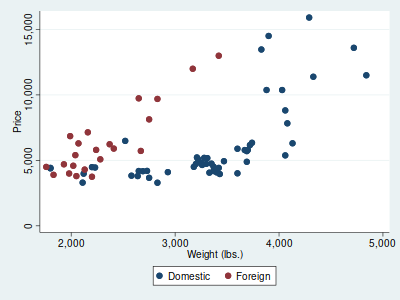
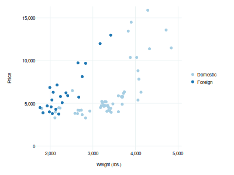

# dahlem
A Stata scheme

## Comparison

### s2color (Stata's default theme)

```
sysuse auto, clear
twoway ///
	(scatter price weight if foreign == 0)  ///
	(scatter price weight if foreign == 1), ///
	legend(order(1 "Domestic" 2 "Foreign")) ///
	scheme(s2color)
```



### dahlem

```
sysuse auto, clear
twoway ///
	(scatter price weight if foreign == 0)  ///
	(scatter price weight if foreign == 1), ///
	legend(order(1 "Domestic" 2 "Foreign")) ///
	scheme(dahlem)
```



## Instructions

1. Install the scheme from GitHub:

```
net install dahlem, replace from(https://raw.github.com/jolyphil/dahlem/master/)
```

2. Set the graphics scheme:

```
set scheme dahlem
```
